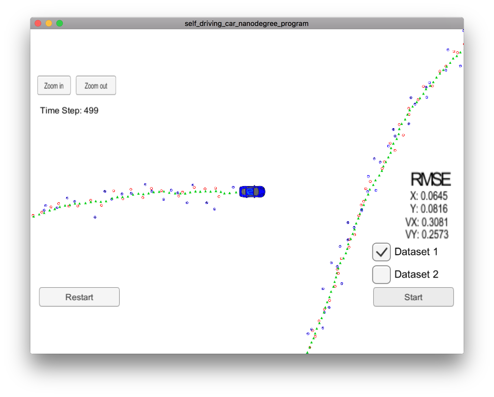

# Unscented Kalman Filter Project

[](http://www.udacity.com/drive)

Overview
---
This repository contains my submission for the Unscented Kalman Filter Project, which is part of the curriculum for term 2 of the Udacity Self-Driving Car Engineer Nanodegree Program. The goal of this project is to implement an Unscented Kalman Filter in C++ and verify its correct functioning using data provided by Udacity. Additionally the process noise standard deviation for both longitudinal and yaw acceleration has to be tuned in order to achieve a specified Root Mean Square Error (RMSE) value below that specified in the project [rubric](https://review.udacity.com/#!/rubrics/783/view). 


[//]: # (Image References)
[image1]: ./analysis/NISlong30_00yaw30_00.jpg "30.00_30.00"
[image2]: ./analysis/NISlong1_25yaw0_25.jpg "1.25_0.25"
[image3]: ./analysis/NISlong0_75yaw0_50.jpg "0.75_0.50.jpg"

### Running the code
To fulfill the requirement that it must be possible to run the project in three different modes: considering laser only, with considering radar only, or with using both sensors, I  added two optional parameters to the main.cpp file included with the starter code for the project. 

The arguments that can be passed to UnscentedKF are as follows:

| Argument Position (argc)     | Description                                  | Default         | 
|:-----------------:|:--------------------------------------------:|:---------------:| 
| 1     | The path to the output file where the NIS values will be written             | No file will be written            |
| 2 | laser, radar, both               | both           | 

The following are some example command lines
```sh
./UnscentedKF output.txt radar
./UnscentedKF output2.txt both
./UnscentedKF output3.txt
```
I also created a data analysis [application](./analysis/dataanalysis.py) using Python and Pandas which was used to generate the NIS plots shown below and to validate that the percentage of NIS values was between the range specified in the readme.txt file for the project. This file can be run as follows where output.txt is the file generated by UnscentedKF as shown above.
```sh
python dataanalysis.py --file output.txt
```

### Results
Looking at the screenshot of the Udacity simulator above you can see that my Unscented Kalman Filter is working correctly. The red and blue circles are simulated LIDAR and Radar readings. The green triangles represent the predicted position from my Kalman Filter. Notice that the green triangles trace a smooth and consistent path even though there is a substantial amount of noise in the sensor readings. I achieved the RMSE shown below (in the far right column) when running my unscented Kalman Filter with Dataset 1 and the optimum values for the process noise standard deviation for longitudinal and yaw acceleration . The RMSE values for the Unscented Kalman filter are well within the tolerances from the [rubric](https://review.udacity.com/#!/rubrics/783/view):

| X Vector | RMSE Extended KF | RMSE Unscented KF |
|:-----:|:-------------:|:-------------:|
| X  | 0.0973  | 0.0645 |
| Y  | 0.0855  | 0.0816 |
| VX  | 0.4513  | 0.3081 |
| VY  | 0.4399  | 0.2573 |

I also included the results from my Extended Kalman Filter project (the middle column) to show the improvement achieved by both using an Unscented Kalman Filter as well as using a Constant Turn Rate and Velocity (CTRV) motion model instead of the Constant Velocity (CV) model used in the Extended Kalman Filter project. Notice that the Unscented Kalman filter with CTRV is significantly better for all elements of the RMSE as compared to the Extended Kalman Filter with CV.

In this project, we were also required to tune the process noise standard deviation for both longitudinal and yaw acceleration to achieve RMSE values below that specified in the project [rubric](https://review.udacity.com/#!/rubrics/783/view). The starter code for the project initialized both of these values to 30. Using a value of 30 for the standard deviations yielded the following values for the RMSE:

| X Vector | RMSE Unscented KF |
|:-----:|:-------------:|
| X  | 0.0979  |
| Y  | 0.1208  |
| VX  | 0.8136  |
| VY  | 0.9955  |

Obviously, these results are very poor and well outside the range of values required by the [rubric](https://review.udacity.com/#!/rubrics/783/view). Some insight can be gained by running a consistency check using the Normalized Innovation Squared (NIS). This yielded the following.

![alt text][image1] 

The 95% chi squared value is shown as the orange line for each measurement type. The value is 7.815 for radar (3 degrees of freedom) and 5.991 for laser (2 degrees of freedom). The charts for both measurement types show that we are over-estimating the uncertainty in our system. Following the direction provided in the course material, the process noise should be set to half of the maximum longitudinal and yaw acceleration found in our environment. I did some research to investigate what these maximum acceleration values should be. I found the following [article](https://www.cyclingforums.com/threads/cornering-gs-on-a-bike.199320/page-3) which suggested that a skilled bicycle rider could do 32 mph on a 100 foot radius corner. Converting this to radians per second yields ~ 0.50 rad/s. If we make the asssumption that this same rider could transition from going straight to cornering at this rate in 1 second, then the maximum acceleration equals 0.5 rad/s2. 

For the longitudinal acceleration, the following [source](https://www.physicsforums.com/threads/how-to-calculate-bicycle-acceleration.504904/) suggests that a good number for the maximum acceleration for a bicycle is 2.5 m/s2. So half of each of these values suggests that we should use: 1.25 m/s2 and 0.25 rad/s2 for the process noise standard deviation longitudinal and lateral acceleration respectively. Running an NIS consistency check using these values yields the following graphs:

![alt text][image2]

There isn't nearly as much difference in these graphs as I expected, but you can clearly see a difference and these graphs look closer to the optimum shown in the course material. More importantly, the RMSE yields the following values which are better than those required by the [rubric](https://review.udacity.com/#!/rubrics/783/view):

| X Vector | RMSE Unscented KF |
|:-----:|:-------------:|
| X  | 0.0748  |
| Y  | 0.0819  |
| VX  | 0.3283  |
| VY  | 0.2795  |

I decided to spend a little more time to see if I could do better. The course material states that you should choose the process noise to be higher than half of the maximum acceleration if you want your application to react faster. If your priority is smooth estimations, then you choose the process noise to be a little lower. Experimentation led to the following values:

|Longitudinal |   Yaw | X |  Y |  Vx | Vy |
|:-----:|:-------------:|:-----:|:-------------:|:-----:|:-------------:|
| 1.25 | 0.25 | 0.0748 | 0.0819 | 0.3283 | 0.2795 |
| 1.5 | 0.25 | 0.0761 | 0.0824 | 0.3315 | 0.284 |
| 2.0 | 0.25 | 0.078 | 0.0837 | 0.338 | 0.2929 |
| 1.0 | 0.25 | 0.0732 | 0.0814 | 0.3254 | 0.2752 |
| 0.75 | 0.25 | 0.0712 | 0.0815 | 0.3229 | 0.2713 |
| 0.5 | 0.25 | 0.0686 | 0.0833 | 0.3211 | 0.2685 |
| 0.25 | 0.25 | 0.0668 | 0.0929 | 0.322 | 0.2695 |
| 0.75 | 0.5 | 0.0645 | 0.0815 | 0.3078 | 0.2571 | ***
| 0.75 | 0.75 | 0.0634 | 0.0827 | 0.3085 | 0.2596 |
| 0.75 | 0.375 | 0.0662 | 0.81 | 0.3113 | 0.2598 |

As you can see the lowest RMSE vector is found for process noise longitudinal and lateral acceleration values of 0.75 and 0.5 respectively. The NIS consistency check at those values looks as follows:

![alt text][image2]

Using these values, 221 of 249 radar measurement values had a NIS value between 0.35 and 7.815 which is 89%.


